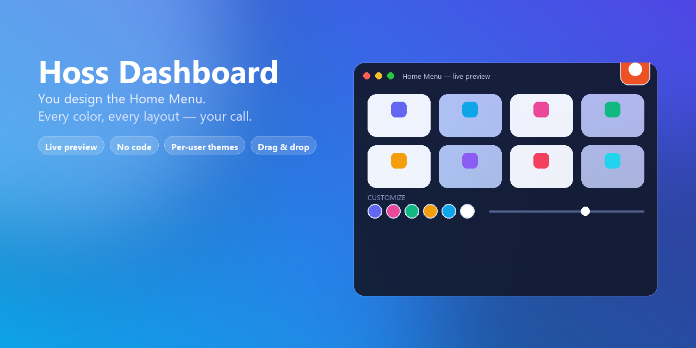

# Hoss Dashboard

**Premium glassmorphism Home Menu for Odoo 17.** Turns the standard Odoo app switcher into a fully customizable,
modern dashboard — live-editable directly from the UI, no code required.

## Features

- **Live visual customizer** — edit background, colors, gradients, spacing, icon shape/size and card style with an
  instant preview, opened from a paint-brush button in the navbar.
- **Theme presets** — Glassmorphism, Minimalist, Flat Material, or fully custom (solid color / gradient / image
  background).
- **Drag & drop app ordering**, with an option for admins to lock positions company-wide.
- **Time-based scheduling** — automatically switch between themes at configured hours of the day.
- **Optional live clock** in the top navbar with adjustable colors, opacity, border and shadow.
- **Custom greeting** — editable title, subtitle, alignment, font sizes and a rich HTML welcome message.
- **Per-user or global configs** — admins can allow specific users to customize their own dashboard, or manage a
  shared company-wide theme from **Settings ▸ Hoss Dashboard Settings**.

## Installation

1. Copy the `hoss_dashboard` folder into your Odoo `addons` path.
2. Update the apps list and install **Hoss App Dashboard** from the Apps menu.
3. Open the Home Menu — the new dashboard is applied automatically.

## Usage

- Click the paint-brush icon in the top navbar to open the customizer panel.
- Adjust background, layout, greeting and clock options with live preview.
- Save the theme for yourself, or (as an administrator) apply it globally to all users.
- Manage all saved themes/systems and per-user permissions from
  **Settings ▸ Hoss Dashboard Settings** and the **Access Rights** tab on a user's form.

## Technical notes

- Models: `hoss.dashboard.config` (theme/settings storage), extension of `res.users` for per-user assignment and
  customization permission.
- Frontend: OWL component (`static/src/js/dashboard_action.js`) registered as the Home Menu client action, styled
  via `static/src/css/home_menu.scss`.
- No external dependencies beyond Odoo's `base` and `web` modules.

## Compatibility

Odoo **17.0** — Community and Enterprise.

## Support

- Author: Hoss
- Website: https://hoss.dev
- Support: support@hoss.dev

## License

OPL-1 (Odoo Proprietary License v1.0). See [LICENSE](LICENSE).
